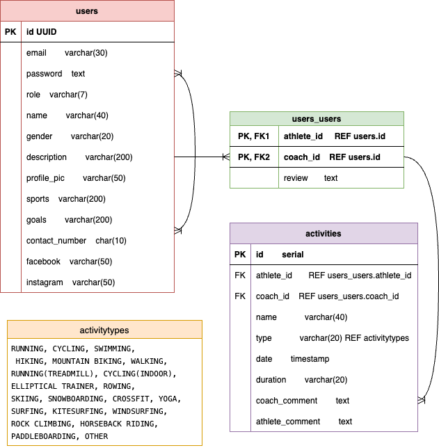

# SOLID


## About

SOLID borrows its name from the word's multiple uses in Singapore. SOLID is a common utterance added at the end of sentences, meaning great or superb. For example, 'Your code was written so well. Solid la!' SOLID also maintains its traditional definition, often being used to describe something that is firmly built and stable, like, 'The foundation of that building is solid.'

SOLID facilitates athletes in building a stable foundation for their own physical wellness, and in doing so, paves the way for greater achievements. Fitness and sport coaches advertise their experience and services on our platform. Athletes browse our on-boarded coaches and choose to work with ones whose philosophies align with their own. Together, athletes and coaches plan, execute, and track their own fitness journeys. SOLID!

SOLID was made as part of a professional software course and it was inspired by the extant coaching application TrainingPeaks.

## Technologies

### Main

- PostgreSQL
- Express
- React
- Node.js

### Adjunctive Tools and Noteworthy Packages

- Material UI (datefns)
- Cloudinary (multer, cloudinary)

### Development Tools

- Postman

## Getting Started

Access the project's public board [here](https://github.com/users/jxrchan/projects/2).

### Setting Up Guide

0. As pre-requisital work, sign up for an account with Cloudinary. Your account credentials are needed for your backend environmental variables. Cloudinary will be used for uploading profile pictures. If you are not interested in this feature, skip this step, and delete codes accordingly.

    Set-up PostgreSQL on your computer. Create a user and an empty database. These user and database information are also needed for the backend environmental variables.

    Run the following commands in PostgreSQL to set up your database:

        ```
        CREATE EXTENSION IF NOT EXISTS "uuid-ossp";

        CREATE TABLE users (
            id UUID PRIMARY KEY DEFAULT uuid_generate_v4(),
            email varchar(30) NOT NULL,
            password text NOT NULL,
            role varchar(7) NOT NULL,
            name varchar(40),
            gender varchar (20),
            description varchar(200),
            profile_picture text,
            sports varchar(200),
            goals varchar(200),
            contact_number char(10),
            facebook text,
            instagram text
        );

        CREATE TABLE users_users (
            athlete_id UUID,
            coach_id UUID,
            review text,
            PRIMARY KEY (athlete_id, coach_id),
            FOREIGN KEY (athlete_id) REFERENCES users (id),
            FOREIGN KEY (coach_id) REFERENCES users (id)
        );

        CREATE TABLE activitytypes (
            type varchar(30) PRIMARY KEY
        );

        INSERT INTO activitytypes VALUES
        ('RUNNING'), ('CYCLING'), ('SWIMMING'), ('HIKING'), ('MOUNTAIN BIKING'),
        ('WALKING'), ('RUNNING (TREADMILL)'), ('CYCLING (INDOOR)'),
        ('ELLIPTICAL TRAINER'), ('ROWING'), ('SKIING'), ('SNOWBOARDING'),
        ('CROSSFIT'), ('YOGA'), ('SURFING'), ('KITESURFING'), ('WINDSURFING'),
        ('ROCK CLIMBING'), ('HORSEBACK RIDING'), ('PADDLEBOARDING'),
        ('OTHER');

        CREATE TABLE activities (
            id serial PRIMARY KEY,
            athlete_id UUID,
            coach_id UUID,
            name varchar(40) NOT NULL,
            type varchar(30) NOT NULL REFERENCES sportstype(type),
            date date NOT NULL,
            duration varchar(20),
            coach_comment text,
            athlete_comment text,
            activity_link varchar(50),
            FOREIGN KEY (athlete_id, coach_id) REFERENCES users_users (athlete_id, coach_id)
        );
        ```

    

    The ERD relating to the above tables is depicted above.

1. Clone the Repository

   ```bash
   git clone https://github.com/jxrchan/SOLID
   ```

2. Navigate to the frontend directory

   ```bash
   cd ./frontend
   ```

3. Create a `.env` file within the root

   ```bash
   touch .env
   ```

4. Add the following environmental variable inside the `.env` file

   ```
   VITE_SERVER=http://localhost:5001
   ```

5. Install Dependencies

   ```bash
   npm i
   ```

6. Start the Development Server

   ```bash
   npm run dev
   ```

7. Start a new terminal

8. Navigate to the backend directory

   ```bash
   cd ../backend
   ```

9. Create a `.env` file within the root

   ```bash
   touch .env
   ```

10. Add the following environmental variables inside the `.env` file and populate them with your own configurations

    ```
    PORT=5001
    DATABASE_USER
    DATABASE_PASS
    DATABASE
    CLOUDINARY_CLOUD_NAME
    CLOUDINARY_API_KEY
    CLOUDINARY_API_SECRET
    ACCESS_SECRET
    REFRESH_SECRET
    ```

11. Install Dependencies

    ```bash
    npm i
    ```

12. Start the Development Server

    ```bash
    npm run dev
    ```

13. Access the Application

    Open your browser and visit [http://localhost:5173](http://localhost:5173).

## Application Interface


The application begins with a login page.

_To improve user experience, conditional rendering is implemented for all forms. It is indicated if an API call is errored or successful_


Clicking through to registration brings you to an intermediate page where the user checks if the email they wish to register with is valid.


A registration dialog appears, prompting the user to fill up more required information to complete registration.

_Dialogs are modals prompting an action and is a built-in component in MUI's Material library. Dialogs are used throughout SOLID to prevent unnecessary navigating_


There are two types of users in SOLID, the ATHLETE and the COACH. The UIs for both users are similar.

However, there are  differences in functions for the ATHLETE and the COACH.

Firstly, the COACH has access to more 'CRUD' functions. COACHES have the ability to add, delete athletes, as well as activities

_The idea for doing so is that a coach  has full reign or 'controls' the programmes for his or her athletes. The athlete 'listens' and provides feedback on said programme._

Separately, athletes do have access to the entire coach database. The coaches do not, however, have access to the athlete database.

_This is deliberate, because athletes should have free reign over they choose as their coach(es). The coach(es) market themselves through their profile and are contactable._


The activities dashboard provides an overview of the activities communicated between coaches and athletes. Optional filtering is provided. Once again, there is a difference between what an ATHLETE and a COACH can update the activity with.

## Credits & Attributions

- Google for the Material UI library and fonts (Roboto & Roboto Slab)
- Cloudinary for its simple-to-use SDKs
- Bing's image generator which runs on Microsoft Copilot for all the images that are on the application
- TrainingPeaks for the inspiration of this project

## Next Steps

Future iterations of the project may include the following:

- Use of TypeScript in the back and front-ends to improve the debugging process
- Implementation of a proper access token refresh function. Currently, the refresh relies on a browser refresh upon expiration of the access token (this is because the refresh function runs in the `<App>` component)
- Incorporation of Strava's third-party API to link activities with data from fitness wearables
- Fully functional calendar on the activities page to allow date filtering of activities based on date ranges instead of single days
